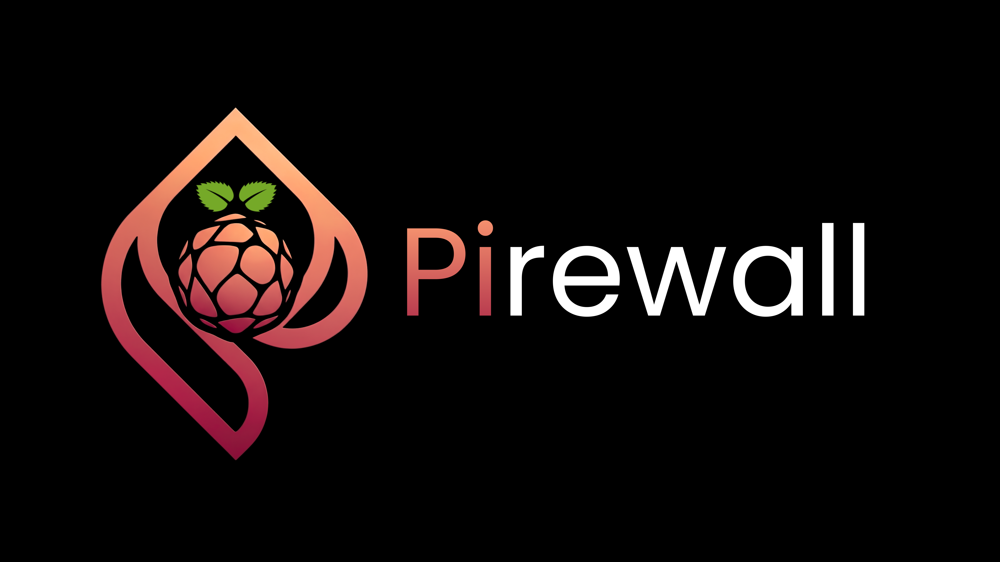

````markdown
<p align="center">
  
</p>

<h1 align="center">Pirewall</h1>

<p align="center">
  <strong>An AI-Powered Adaptive Firewall for Raspberry Pi</strong>
</p>

<p align="center">
  
  
  
  
  
</p>

---

Pirewall is a next-generation adaptive firewall designed for the Raspberry Pi that combines traditional firewall technology with artificial intelligence to detect both known and previously unseen cyber threats.

Unlike conventional firewalls that rely solely on static rule sets or signature databases, Pirewall performs lightweight flow-based traffic analysis and leverages machine learning to identify malicious behavior in real time. By combining supervised attack classification with unsupervised anomaly detection, the system can recognize both previously observed attacks and suspicious unknown activity while remaining suitable for deployment on resource-constrained edge devices.

Rather than automatically modifying firewall policies, Pirewall generates validated candidate rules based on observed network behavior, ensuring that adaptive security decisions remain transparent, explainable, and resistant to false positives.

This project is being developed as an undergraduate cybersecurity capstone project, exploring how intelligent adaptive security systems can be implemented on low-cost hardware without sacrificing performance, modularity, or scalability.

---

# Features

- AI-assisted intrusion detection
- Flow-based traffic analysis
- Detection of both known and unknown attacks
- Lightweight deployment on Raspberry Pi 4
- Adaptive firewall rule recommendation
- Rule validation before deployment
- Real-time monitoring dashboard
- Security event logging
- Modular architecture for future expansion

---

# Architecture

```text
                Network Traffic
                       │
                       ▼
               Packet Capture Engine
                       │
                       ▼
             Network Flow Generation
                       │
                       ▼
             Feature Extraction Engine
                       │
          ┌────────────┴────────────┐
          ▼                         ▼
  LightGBM Classifier      Isolation Forest
 (Known Attacks)         (Unknown Anomalies)
          │                         │
          └────────────┬────────────┘
                       ▼
               Threat Scoring Engine
                       │
                       ▼
              Behaviour Analysis Engine
                       │
                       ▼
          Candidate Rule Generation Engine
                       │
                       ▼
              Rule Validation Engine
                       │
                       ▼
             Firewall Rule Deployment
                       │
                       ▼
          Logging • Dashboard • Alerts
```

---

# Project Structure

```text
PiReWall/
│
├── docs/
│
├── models/
│   ├── known/
│   ├── anomaly/
│   ├── training/
│   └── preprocessing/
│
├── engine/
│   ├── capture/
│   ├── flow_generator/
│   ├── feature_extractor/
│   ├── classifier/
│   ├── anomaly_detector/
│   ├── threat_scoring/
│   ├── behavior_analysis/
│   ├── rule_engine/
│   ├── validator/
│   ├── firewall/
│   └── logger/
│
├── dashboard/
├── simulator/
├── datasets/
├── scripts/
├── tests/
│
├── requirements.txt
├── README.md
└── LICENSE
```

---

# Machine Learning Pipeline

PiReWall employs two complementary machine learning models to provide adaptive threat detection.

### Known Attack Detection

A supervised **LightGBM** classifier is trained to recognize attacks previously observed during training.

Examples include:

- Port Scanning
- SYN Flood
- SSH Brute Force
- SQL Injection
- DNS Spoofing
- ARP Spoofing

### Unknown Attack Detection

An **Isolation Forest** model detects anomalous network behavior that deviates from established normal traffic patterns. Instead of assigning a predefined attack label, it produces an anomaly score that contributes to the overall threat evaluation process.

---

# Threat Evaluation

Outputs from both machine learning models are combined to produce a weighted threat score based on:

- Classification confidence
- Anomaly score
- Behavioural patterns
- Frequency of repeated activity
- Historical observations

Depending on the resulting score, PiReWall can:

- Allow traffic
- Log suspicious activity
- Generate administrator alerts
- Recommend new firewall rules

---

# Adaptive Rule Engine

Rather than immediately changing firewall configurations, PiReWall creates **candidate firewall rules** derived from observed malicious behavior.

Each candidate rule undergoes a validation process before deployment to minimize false positives and prevent accidental disruption of legitimate network traffic.

Possible outcomes include:

- Reject candidate rule
- Recommend rule for administrator approval
- Automatically deploy validated rule (configurable)

---

# Technologies

- Python
- LightGBM
- Isolation Forest
- Scikit-learn
- Raspberry Pi OS
- Netfilter / iptables
- Linux Networking
- Flask
- React
- SQLite (future PostgreSQL support)

---

# Datasets

The project uses the following datasets throughout development:

- **CICIDS2017** — Model training
- **UNSW-NB15** — Model validation
- **Custom laboratory traffic** — Final testing and evaluation

---

# Target Hardware

### Minimum Deployment

- Raspberry Pi 4
- 4 GB RAM
- Raspberry Pi OS
- Ethernet Connectivity

### Development Environment

- Windows 11
- NVIDIA RTX GPU (optional for model training)

---

# Development Roadmap

- [x] System Architecture
- [x] Component Design
- [ ] Packet Capture Engine
- [ ] Flow Generation
- [ ] Feature Extraction
- [ ] Machine Learning Model Training
- [ ] Threat Scoring Engine
- [ ] Behaviour Analysis
- [ ] Adaptive Rule Engine
- [ ] Rule Validation
- [ ] Dashboard Development
- [ ] Raspberry Pi Deployment
- [ ] Performance Evaluation

---

# Future Improvements

- Online model retraining
- Federated learning between PiReWall devices
- Cloud management dashboard
- Threat intelligence integration
- Explainable AI for firewall decisions
- Multi-device orchestration

---

# Disclaimer

PiReWall is developed for educational and research purposes as part of an undergraduate cybersecurity capstone project. It is not intended for production environments without extensive testing, validation, and security auditing.

---

# License

This project is licensed under the MIT License.
````
